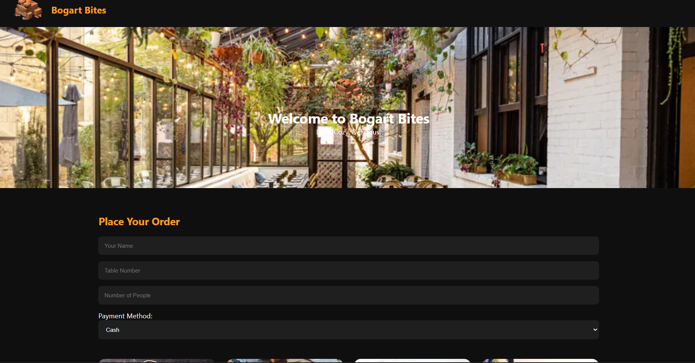
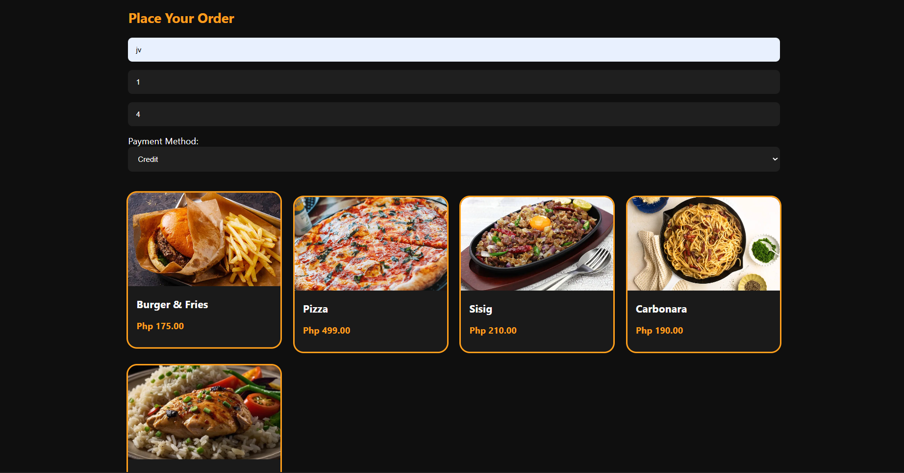
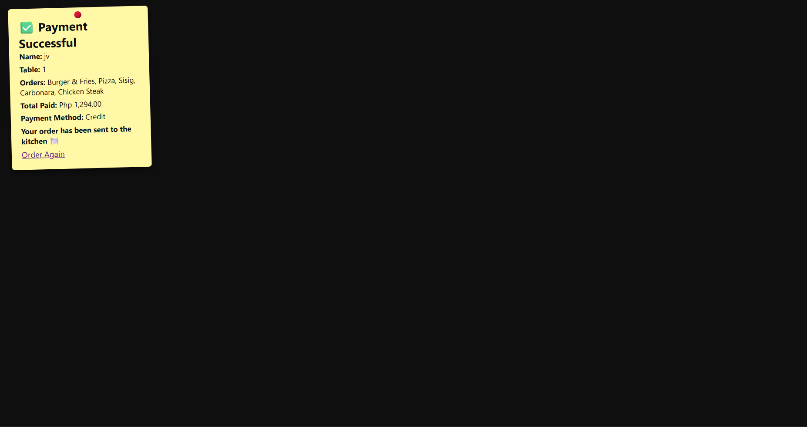
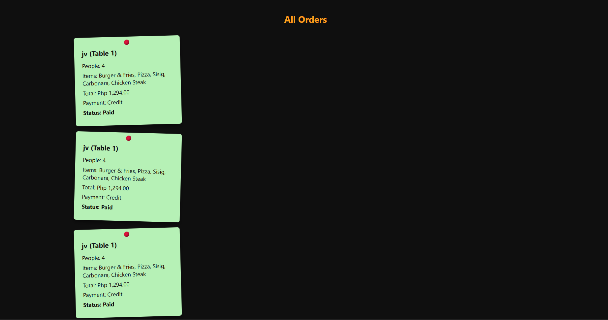

# Bogart Bites 🍔

**Bogart Bites** is a simple dynamic restaurant web application featuring a table-based ordering system and order display functionality.

This project was built as part of my learning journey in web development, with a focus on backend logic, server-side processing, and dynamic data handling.

---

## ✨ Features

- 📋 Menu display with food items
- 🪑 Table-based ordering system
- 🧾 Order processing logic
- 📊 Order display for tracking customer orders
- 🎨 Basic UI styling for a restaurant setting

---

## 🛠️ Tech Stack
- PHP
- HTML
- CSS
- MySQL (database connection handled in `db.php`)

---

## 🖼️ Preview

### Homepage

### Order System

### Payment Successful

### Order Tabs

Screenshots showcasing the following features will be added:

- Homepage
- Order System
- Payment Successful
- Order tabs

---

## 🚀 How to Run
This project is intended to be run on a local server environment such as:
- XAMPP
- WAMP
- MAMP

---

### Steps:
1. Place the project folder inside the server's `htdocs` directory.
2. Start Apache and MySQL.
3. Configure the database connection in `db.php`.
4. Open the project in a browser using:

---

## Notes
- This project uses PHP and cannot be hosted on static hosting services like GitHub Pages.
- It is designed to demonstrate backend logic and server-side processing.
- Future improvements may include better validation, enhanced UI, and additional order management features.

---

## 👤 Author

**Jose Victor Siong**  
BS Information Technology Student  

- GitHub: https://github.com/Lemon-frog
- Project: Bogart Bites
